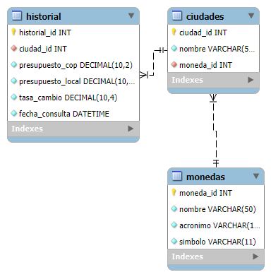

# Prueba Técnica - Analista de Soporte Nivel 1

## Descripción

Esta aplicación web permite a los usuarios conocer el clima actual y realizar la conversión de su presupuesto de viaje en pesos colombianos a la moneda local de la ciudad de destino seleccionada.

### Funcionalidades:
- Selección de ciudad de destino (Londres, Nueva York, París, Tokio, Madrid).
- Ingreso del presupuesto en pesos colombianos.
- Obtención del clima actual en la ciudad seleccionada.
- Conversión del presupuesto a la moneda local, mostrando el símbolo correspondiente y la tasa de cambio aplicada.
- Funcionalidad opcional: Agregar historial de consultas anteriores

## Tecnologías Utilizadas

- **Backend:** PHP 7.x con Laravel.
- **Base de Datos:** MySQL.
- **Frontend:** Angular
- **Servicios Externos:** Weather API y Exchange Rate API.

## Diagrama de bases de datos

## Enlaces de videos explicativos
[Video demostrativo](https://drive.google.com/file/d/1WS5dWc0helyHVikPXvp6_8Jyn7KNH86B/view?usp=sharing)

[Video explicativo del código](https://drive.google.com/file/d/1tTN_Oz_m-R0EXFR6RfTHInsXywdjR9Cy/view?usp=sharing)
